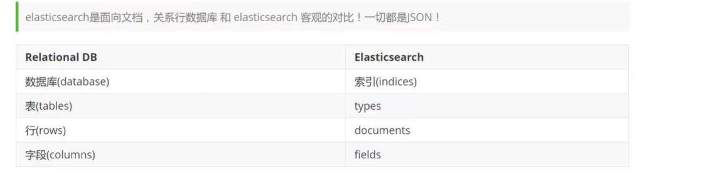
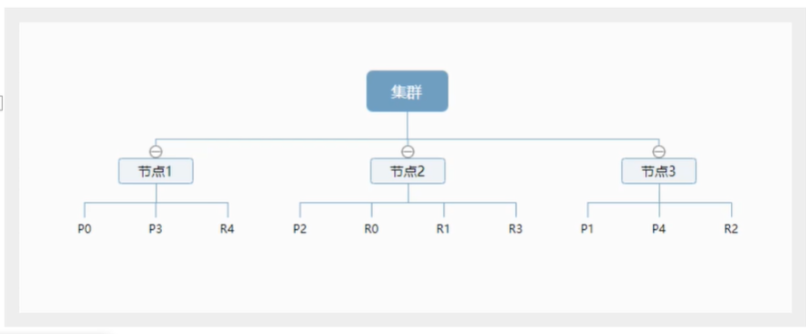
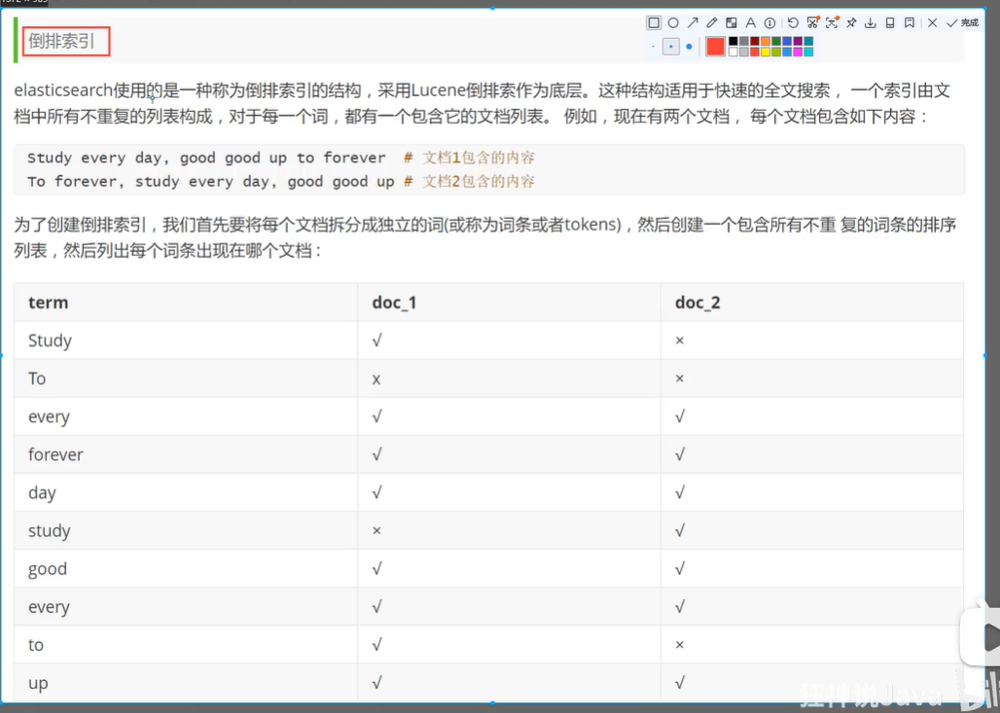
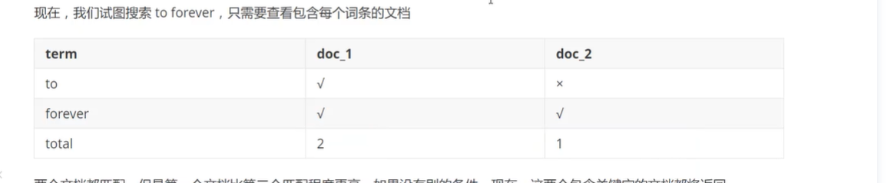
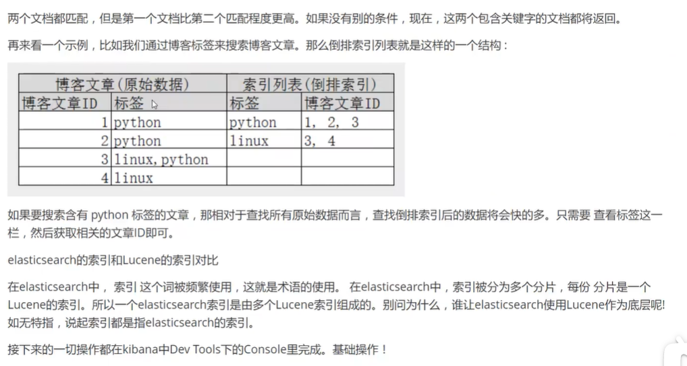

# ES核心概念

<p style='color:red'>这篇文章主要介绍es是如何存储数据，数据结构是什么，又是如何实现搜索！</p>

## 核心概念

集群，节点，分片，索引，类型，文档，映射是什么？

> 核心

* 索引： 我要建个数据库
* 类型（mapping）：我要建张表，指定字段类型
* 文档：我要存一条数据

为什么ES查询那么快？ 就是应为底层使用了分片和倒排索引技术！

> ES和数据库的对比



elastaicsearch（集群）中可以包含多个索引（数据库），每个索引可以包含多个类型（表），每个类型可以包含多个文档（行），每个文档可以有多个字段（列字段）

## 物理设计

elastaicsearch在后台把每个索引划分成多个分片，每个分片可以在集群中的不同服务迁移。

单个也是集群，集群名就是elastaicsearch

## 逻辑设计

一个索引类型中，包含多个文档，比如说文档1，文档2。当我们索引一篇文章时，可以通过这样的顺序找到它

索引>类型>文档id

通过这个组合我们就可以索引出具体的文档。（文档id不必是整数，实际上它是字符串）

### 文档

> 就是我们一条条数据

```
user
1 zhangsan 18
2 lisi     24
```

elastaicsearch是面向文档的，这也就意味着索引和搜索的最小单位使文档。

文档有几个重要的属性：

* 自我包含

  一篇文档同时包含字段和对应的值，也就是key：value

* 可以是层次型的

  数据中包含数据，也就是json对象

* 灵活的结构

  文档不依赖预先定义的模式，在关系数据库中，必须定义好字段才能使用，elastaicsearch中，字段非常灵活，会随着数据动态创建字段！

### 类型

> 类型是文档的容器，就行数据库中表格是行的容器

类型中对于字段的定义称为映射，，比如name映射为字符串类型。我们说文档是无模式的，它不需要拥有映射中所定义的所有字段，比如说新增一个字段。ES是如何做到的呢？ES会自动的把新字段加入映射，但这个字段不确定是什么类型，es就会猜，如果是18，那么es就会认为它是整型，但是es也有可能会猜不对，所以最安全的方式就是定义好所需要的映射，这点和关系型数据库殊途同归！先定义好字段，那后使用，不要搞什么幺蛾子！

### 索引

索引是映射类型的容器，es的索引是一个非常大的文档集合。索引存储了映射类型字段和其他设置，它们被存储在各个分片上！

#### 物理设计： 节点和分片 如何工作

一个集群至少包含一个节点，一个节点也就是一个es进程，节点可以有多个索引，索引有多个分片（默认5个，主分片），每个主分片会有一个副本（复制分片）。



上图是一个有三个节点的集群，可以看到主分片和复制分片都不在同一个节点中，这样有利于某个节点挂了，数据也不会丢失。实际上，一个分片就是一个Lucene索引，一个包含倒排索引的文件目录，倒排索引的结构使得es在不扫描全部文档的情况下，就能告诉你那些文档包含特定的关键字！

#### 倒排索引







匹配字段的所少也就称之为权重！

