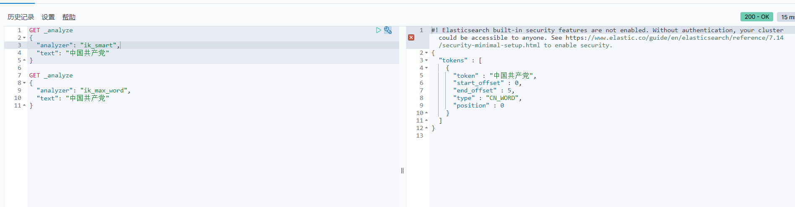
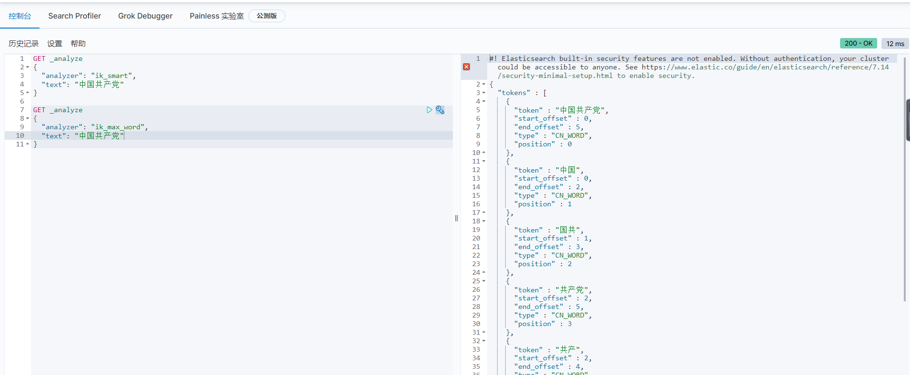

# ik中文分词器

> es分词器对中文支持不好，推荐使用ik中文分词器

## 下载

下载地址; https://github.com/medcl/elasticsearch-analysis-ik/releases

## 安装

解压之后放在es，plugin目录下就可以使用了。

## 分词器类型及效果

* ik_smart

> 最小粒度划分,不可能有重复的数据：比如共产党，共产

* ik_max_word

> 最细粒度划分

分词器如何切分是根据词库来的

分词器需要自己维护一份字典，ik分词器提供的字典不够用，字典中配置了词后，需要重启es。

