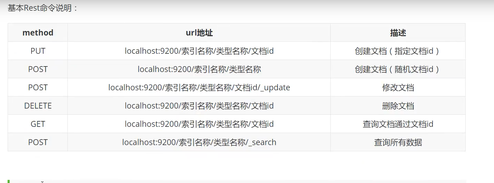

# 通过Restful风格操作ES



<p style="color:red">kibana中进行文档查询的时候，不要加类型，不然不会自动提示！</p>

## 索引操作

### 新增索引

> 新增索引推荐使用PUT，推荐在创建索引的时候指定类型映射

```json
PUT /person
{
  "mappings": {
    "properties": {
      "name": {
        "type": "text"
      },
      "age":{
        "type": "integer"
      },
      "birthday":{
        "type": "date"
      }
    }
  }
}
```

### 查询索引

```json
GET /person
```

### 修改索引

> 索引一旦创建，mapping 中的字段就不能修改，只能增加字段，而且添加字段只能通过添加文档，让es自动指定mapping类型！所以所在建索引之前一定要想好类型映射。

```json
PUT /person/_doc/1
{
  "name":"zhangsan",
  "age":23,
  "birthday": "1997-01-01",
  "desc":"this is a message"
}
```


### 删除索引

```json
DELETE /person
```

## 文档操作

> 文档操作在开发中最常使用

### 新增文档

> PUT和POST都可以，但是PUT新增必须指定ID，而POST可以生成随机id
>
> 推荐使用POST新增！

PUT

```json
PUT /person/_doc/1
{
  "name":"lisi",
  "age":23,
  "birthday": "1997-01-01",
  "desc":"this is a message"
}
```

POST

```json
POST /person/_doc
{
  "name":"zhangsan",
  "age":23,
  "birthday": "1997-01-01",
  "desc":"this is a message"
}
```

### 查询文档

#### 简单查询

##### ID查询

```json
GET /person/_doc/1
```

##### 查询全部

> 请求方式POST和GET都可以，推荐使用POST

```json
GET /person/_doc/_search
```

##### 条件查询

```json
GET /person/_doc/_search?q=name:李&q=age:23
```

#### 复杂查询

> 排序，分页，模糊查询，精准查询，范围查询，多值查询

##### 条件查询

> match类似于myql中的=，但是比之功能更强
>
> 注意点：match不支持多字段查询
>
> match在匹配会使用到分词器

```json
GET /person/_doc/_search
{
  "query":{
    "match":{
      "name":"李"
    }
  }
}
```

##### 精度查询

> 也就是说查询的时候不使用分词器，直接查询倒排索引

```json
GET test2/_search
{
  "query": {
    "term": {
      "name": "张明珂"
    }
  }
}
```

##### 结果过滤

> 指定你要查询那些字段

```
GET /person/_doc/_search
{
  "query":{
    "match":{
      "name":"李"
    }
  },
  "_source":["name"]
}
```

##### 排序

> 排序需要使用到sort和order,支持多此段排序，但是排序的默认不支持text类型（耗内存）。

```json
GET /person/_doc/_search
{
  "query":{
    "match":{
      "name":"李"
    }
  },
  "sort":[{
    "age":{
      "order":"desc"
    },
    "birthday":{
      "order":"desc"
    }
  }]
}
```

##### 分页

> 分页使用from和size指定索引位置

```json
GET /person/_doc/_search
{
  "query":{
    "match":{
      "name":"李"
    }
  },
  "sort":[{
    "age":{
      "order":"desc"
    },
    "birthday":{
      "order":"desc"
    }
  }],
  "from":0,
  "size":1
}
```

##### 高亮查询

> highlight 设置高亮字段

```json
GET person/_search
{
  "query": {
    "match": {
      "name": "李四"
    }
  },
  "highlight": {
    "fields": {
      "name": {}
    }
  }
}
```

##### 自定义高亮查询

> pre_tags：前缀
>
> post_tags: 后缀

```json
GET person/_search
{
  "query": {
    "match": {
      "name": "李四"
    }
  },
  "highlight": {
    "pre_tags": "<p style='color:red'>",
    "post_tags": "</p>", 
    "fields": {
      "name": {}
    }
  }
}
```


##### bool查询

###### 与查询(must)

> must(相当于mysql中的and) 比如 where id = 1 and name = xxx

```json
GET person/_search
{
  "query": {
    "bool": {
      "must": [
        {
          "match": {
            "name": "zhangsan"
          }
        },
        {
          "match": {
            "age": "23"
          }
        }
      ]
    }
  }
}
```

###### 或查询（should）

> should相当于mysql中的or，比如 where id = 1 or name= xxx

```json
GET person/_search
{
  "query": {
    "bool": {
      "should": [
        {
          "match": {
            "name": "zhangsan"
          }
        },
        {
          "match": {
            "age": "23"
          }
        }
      ]
    }
  }
}
```

###### 不等于与查询（must_not)

> 相当于MySQL中的not
>
> match在匹配中文的时候相当于与查询条件的分词结果进行匹配。

```json
GET person/_search
{
  "query": {
    "bool": {
      "must_not": [
        {
          "match": {
            "age": "23"
          }
        },
        {
          "match": {
            "name": "zhangsan"
          }
        }
      ]
    }
  }
}
```

###### 范围查询

> 使用filter中的range，类似于mysql中的>,<,>=,<=

| gt   | 大于     |
| ---- | -------- |
| lt   | 小于     |
| gte  | 大于等于 |
| lte  | 小于等于 |

```json
GET person/_search
{
  "query": {
    "bool": {
      "filter": [
        {
          "range": {
            "age": {
              "gt": 23,
              "lt": 240
            }
          }
        }
      ]
    }
  }
}
```

###### 多值查询

> 使用空格分开,比如查询name是zhangsan和zhangsan1

```json
GET person/_search
{
  "query": {
    "match": {
      "name": "zhangsan zhangsan1"
    }
  }
```


### 修改文档

> PUT和POST都可以修改文档，但是PUT只支持整体更新，而POST可以做到局部更新！，推荐使用POST进行更新操作。

#### 通过ID更新

> _update就是局部更新

```
POST /person/_doc/1/_update
{
  "doc":{
    "name":"李四"
  }
}
```

### 删除文档

#### 通过ID删除

```json
DELETE /person/_doc/1
```

## 附录

* hits格式介绍


