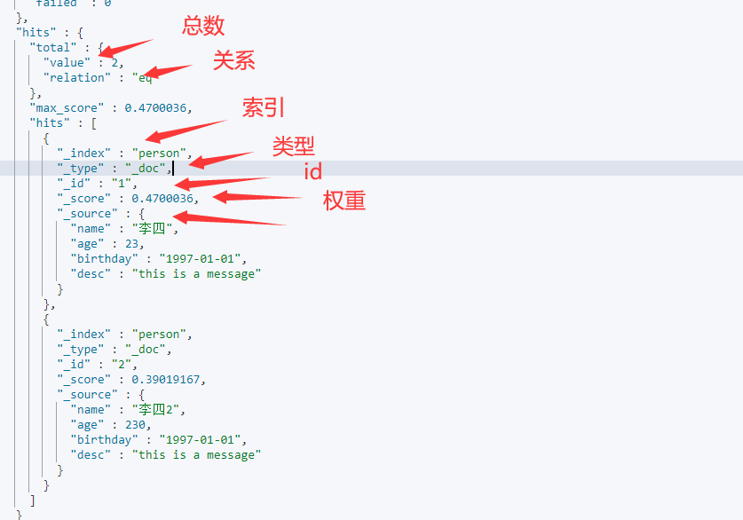

# 通过Restful风格操作ES


## 索引操作

### 新增索引

> 新增索引推荐使用PUT，推荐在创建索引的时候指定类型映射

```json
PUT /person
{
  "mappings": {
    "properties": {
      "name": {
        "type": "text"
      },
      "age":{
        "type": "integer"
      },
      "birthday":{
        "type": "date"
      }
    }
  }
}
```

### 查询索引

```json
GET /person
```

### 修改索引

> 索引一旦创建，mapping 中的字段就不能修改，只能增加字段，而且添加字段只能通过添加文档，让es自动指定mapping类型！所以所在建索引之前一定要想好类型映射。

```json
PUT /person/_doc/1
{
  "name":"zhangsan",
  "age":23,
  "birthday": "1997-01-01",
  "desc":"this is a message"
}
```


### 删除索引

```json
DELETE /person
```

## 文档操作

> 文档操作在开发中最常使用

### 新增文档

> PUT和POST都可以，但是PUT新增必须指定ID，而POST可以生成随机id
>
> 推荐使用POST新增！

PUT

```json
PUT /person/_doc/1
{
  "name":"lisi",
  "age":23,
  "birthday": "1997-01-01",
  "desc":"this is a message"
}
```

POST

```json
POST /person/_doc
{
  "name":"zhangsan",
  "age":23,
  "birthday": "1997-01-01",
  "desc":"this is a message"
}
```

### 查询文档

#### 简单查询

##### ID查询

```json
GET /person/_doc/1
```

##### 查询全部

> 请求方式POST和GET都可以，推荐使用POST

```json
GET /person/_doc/_search
```

##### 条件查询

```json
GET /person/_doc/_search?q=name:李&q=age:23
```

#### 复杂查询

> 排序，分页，模糊查询，精准查询，范围查询，多值查询

##### 模糊查询

> match类似于myql中的like，但是比之功能更强
>
> 注意点：match不支持多字段查询

```json
GET /person/_doc/_search
{
  "query":{
    "match":{
      "name":"李"
    }
  }
}
```

##### 结果过滤

> 指定你要查询那些字段

```
GET /person/_doc/_search
{
  "query":{
    "match":{
      "name":"李"
    }
  },
  "_source":["name"]
}
```

### 修改文档

> PUT和POST都可以修改文档，但是PUT只支持整体更新，而POST可以做到局部更新！，推荐使用POST进行更新操作。

#### 通过ID更新

> _update就是局部更新

```
POST /person/_doc/1/_update
{
  "doc":{
    "name":"李四"
  }
}
```

### 删除文档

#### 通过ID删除

```json
DELETE /person/_doc/1
```

## 附录

* hits格式介绍


