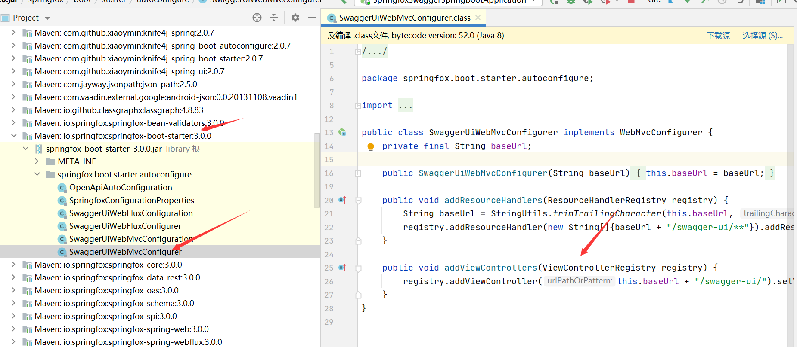

# swagger 

> swagger 介绍文档： https://swagger.io/docs/open-source-tools/swagger-editor/

swagger家族开源成员及其作用

* Swagger Editor

  一款可以通过编写yml文件实时生成接口界面的工具，支持服务端和客户端代码生成。

  简单来说就是边编写接口文档，边预览，边测试。

  生成的代码也不符合我们的习惯。

* Swagger UI

  也就是Swagger Editor中的页面文党

* Swagger Codegen

  通过接口文档生成代码

* Swagger core（**也称为"Swagger"**）

  [Swagger core 作用介绍](https://github.com/swagger-api/swagger-core/wiki/Swagger-2.X---Getting-started#what-is-it-about)

  简单说就是把java中的代码规则解释为openApi形式

http://springfox.github.io/springfox/docs/current/#springfox-swagger-ui)

# spring-fox

> springmvc 集成 swagger的项目，这个也就是我们实际开发中使用到！

[GitHub地址](https://github.com/springfox/springfox)

# Knife4j

> 一款swagger的ui框架，对swgger功能进行了增强

[GitHub地址](https://github.com/xiaoymin/swagger-bootstrap-ui)

原生的swagger-ui太丑，推荐使用这个！

支持可插拔，对代码没有侵入！

# 实际开发

> 我们实际开发最常用的就是swagger-core提供的注解，他会生成openApi格式文档，springfox把这个进行修改转换成json格式，让后让swagger-ui取展示。

* 默认swagger-ui地址

  [Swagger UI](http://localhost:8080/swagger-ui/index.html)

  在项目中哪里配置的：

  

* 默认生成的json资源存放地

  http://localhost:8080/swagger-resources

  可以看到具体api-doc文档地点和信息

* 查看api-doc文档信息

  [localhost:8080/v2/api-docs](http://localhost:8080/v2/api-docs)

  swagger-ui就是通过文档信息生成的页面信息！
