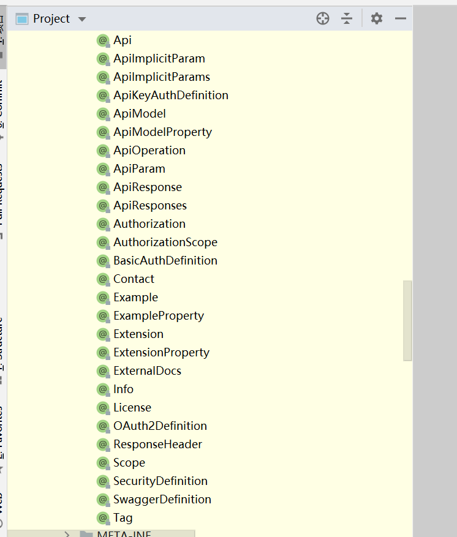

一共27个注解

# 实体类（模型）

> 作用在实体类上的注解

### @ApiModel

> 类说明

用于类 ；表示对类进行说明，用于参数用实体类接收 
value–表示对象名 
description–描述 
都可省略 

### @ApiModelProperty

> 字段说明

用于方法，字段； 表示对model属性的说明或者数据操作更改 
value–字段说明 
name–重写属性名字 
dataType–重写属性类型 
required–是否必填 
example–举例说明 
hidden–隐藏

# Controller

> 用于Controller的注解

### @Api

用于类；表示标识这个类是swagger的资源 
tags–表示说明 
value–也是说明，可以使用tags替代 
但是tags如果有多个值，会生成多个list

### @ApiOperation

用于方法；表示一个http请求的操作 
value用于方法描述 
notes用于提示内容 
tags可以重新分组（视情况而用） 

### @ApiParam

用于方法，参数，字段说明；表示对参数的添加元数据（说明或是否必填等） 
name–参数名 
value–参数说明 
required–是否必填

# 参考

[常用注解说明](https://blog.csdn.net/wyb880501/article/details/79576784)

