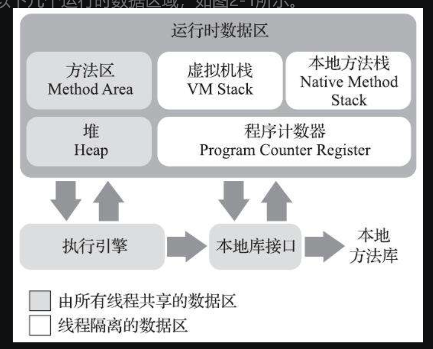

# 自动内存管理

> java自动内存回收机制虽然方便，但是一旦出现问题，如果对jvm没有一定的了解，问题不易排查。

## 运行时数据区

### 程序计数器

> 控制当前线程的走向

程序计数器（Program Counter Register）是一块较小的内存空间，它可以看作是当前线程所执行的字节码的行号指示器。

字节码解释器工作时就是通过改变这个计数器的值来选取下一条需要执行的字节码指令，它是程序控制流的指示器，分支、循环、跳转、异常处理、线程恢复等基础功能都需要依赖这个计数器来完成。

此内存区域是唯一一个在《Java虚拟机规范》中没有规定任何OutOfMemoryError情况的区域。（也就是说内存不足不会出现在这个区域）

线程私有——每条线程都需要有一个独立的程序计数器，各条线程之间计数器互不影响，独立存储，我们称这类内存区域为“线程私有”的内存。

### Java虚拟机栈

> 存储局部变量表、操作数栈、动态连接、方法出口等信息。

Java虚拟机栈（Java Virtual MachineStack）也是线程私有的，它的生命周期与线程相同。

虚拟机栈描述的是Java方法执行的线程内存模型：每个方法被执行的时候，Java虚拟机都会同步创建一个栈帧[插图]（Stack Frame）用于存储局部变量表、操作数栈、动态连接、方法出口等信息。每一个方法被调用直至执行完毕的过程，就对应着一个栈帧在虚拟机栈中从入栈到出栈的过程。

在《Java虚拟机规范》中，对这个内存区域规定了两类异常状况：如果线程请求的栈深度大于虚拟机所允许的深度，将抛出**StackOverflowError**异常；如果Java虚拟机栈容量可以动态扩展[插图]，当栈扩展时无法申请到足够的内存会抛出**OutOfMemoryError**异常。

### 本地方法栈

> 为虚拟机使用到的本地方法提供服务。

本地方法栈（Native Method Stacks）与虚拟机栈所发挥的作用是非常相似的，其区别只是虚拟机栈为虚拟机执行Java方法（也就是字节码）服务，而本地方法栈则是为虚拟机使用到的本地（Native）方法服务。

### java堆

> 存放对象实例

在《Java虚拟机规范》中对Java堆的描述是：“所有的对象实例以及数组都应当在堆上分配“。

Java堆是垃圾收集器管理的内存区域。

如果在Java堆中没有内存完成实例分配，并且堆也无法再扩展时，Java虚拟机将会抛出OutOfMemoryError异常。

### 方法区

> 存储已被虚拟机加载的类型信心，常量，静态变量，即时编译器编译后的代码缓存等数据。

方法区（Method Area）与Java堆一样，是各个线程共享的内存区域，它用于存储已被虚拟机加载的类型信息、常量、静态变量、即时编译器编译后的代码缓存等数据。

在java8之前，方法区常被称为永久代，也就是说这部分的区域数据一旦创建就不会销毁。

这区域的内存回收目标主要是针对常量池的回收和对类型的卸载

根据《Java虚拟机规范》的规定，如果方法区无法满足新的内存分配需求时，将抛出OutOfMemoryError异常。

### 扩展

运行时常量池

> 存放编译器生成的各种字面量和符号引用

运行时常量池（Runtime Constant Pool）是方法区的一部分。Class文件中除了有类的版本、字段、方法、接口等描述信息外，还有一项信息是常量池表（Constant Pool Table），用于存放编译期生成的各种字面量与符号引用，这部分内容将在类加载后存放到方法区的运行时常量池中。

直接内存

> 堆外内存

在JDK 1.4中新加入了NIO（New Input/Output）类，引入了一种基于通道（Channel）与缓冲区（Buffer）的I/O方式，它可以使用Native函数库直接分配堆外内存，然后通过一个存储在Java堆里面的DirectByteBuffer对象作为这块内存的引用进行操作。

为什么要提直接内存？

设置jvm内存的时候可能会忽略这部分内存，从而导致使用到的内存空间大于物理内存，导致OutOfMemoryError的错误。

