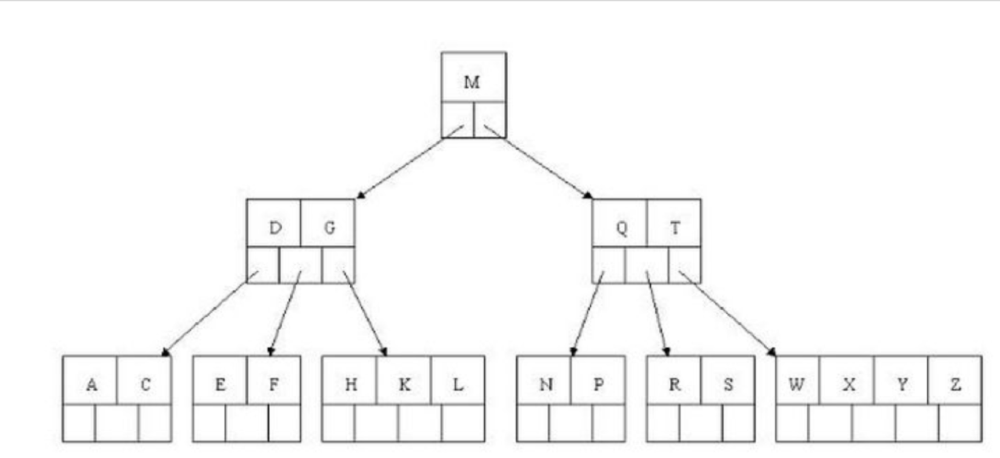

# 介绍

> mysql是现代企业中最常使用的数据库

参考文档：https://dev.mysql.com/doc/refman/5.7/en/connector-j-info.html

本篇内容基于innoDB

## 索引

> innoDB中一共有两种索引，聚集索引和二级索引

### 聚集索引

每个 InnoDB 表都有一个称为聚集索引的特殊索引，用于存储行数据。通常，聚集索引与主键同义。

* PRIMARY KEY 时，InnoDB 将其用作聚集索引。

* 如果您没有为表定义 PRIMARY KEY，则 InnoDB 使用第一个 UNIQUE 索引，键列定义为 NOT NULL 的作为聚集索引。
* 如果表没有 PRIMARY KEY 或合适的 UNIQUE 索引，InnoDB 会在包含行 ID 值的合成列上生成一个名为 GEN_CLUST_INDEX 的隐藏聚集索引。

### 二级索引

聚集索引以外的索引称为二级索引。 在 InnoDB 中，二级索引中的每条记录都包含该行的主键列，以及为二级索引指定的列。 InnoDB 使用这个主键值来搜索聚集索引中的行。

> 如果主键很长，二级索引会占用更多的空间，所以主键短是有利的。

### 索引结构

处空间索引是R树外，其他索引都是B树。

这里讲的B树非传统意义上的B树，而是一种变种的B树，具体如何变种，mysql并未在官方文档中明说，而是给出了B树的结构。

#### B树

> B树为什么查询效率高，因为它有效地避免了全文扫描。

B树的查找规则：

二分法规则，左小右大，左边放小于当前节点值的子节点、右边放大于当前节点值的子节点

### 索引扩展

#### 全文索引

innoDB中的全文索引使用了和es相同的索引结构：倒排索引。

适用于查文章，大量的字符串信息。

#### BTREE和HASH

innoDB引擎中使用到的索引结构只有BTREE，HASH只用于memory引擎。

