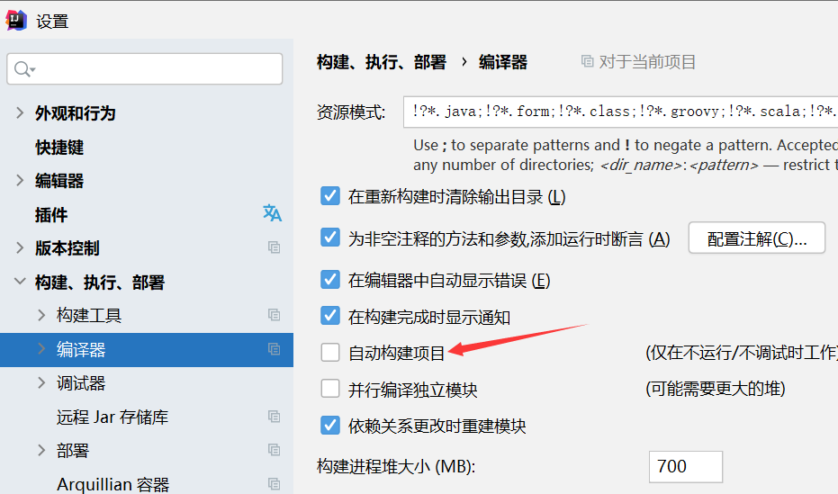
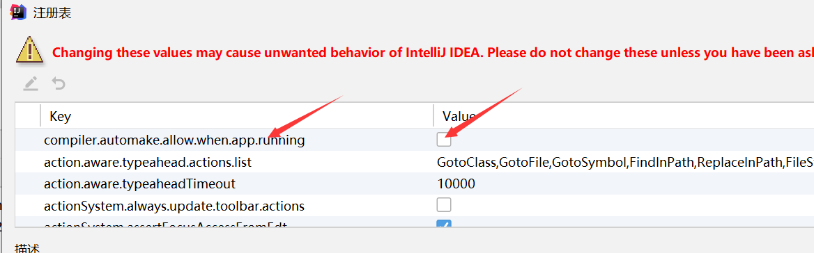

# Developer Tools

文章参考地址：https://docs.spring.io/spring-boot/docs/current/reference/html/using.html#using.devtools

> 为什么SpringBoot引入dev tools,提高开发者开发效率。
>
> 其中最重要的就是"自动重启"（也就是我们常说的热部署）

Dev tools包含那些内容

* 属性默认值
* 自动重启
* 实时重载
* 全局设置
* 远程应用程序

## 属性默认值

devtools 默认的属性配置，类似于autoConfig，已经提前设置号默认值了。

## 自动重启（最重要）

> 自动重启也就是热部署

### 触发条件

由于 DevTools 监控类路径资源，触发重启的唯一方法是更新类路径。更新类路径的方式取决于您使用的 IDE：

- 在 Eclipse 中，保存修改后的文件会导致更新类路径并触发重新启动。
- 在 IntelliJ IDEA 中，构建项目 ( `Build +→+ Build Project`) 具有相同的效果。
- 如果使用构建插件，`mvn compile`为 Maven 或`gradle build`Gradle运行将触发重新启动。

我们通常触发是使用IDEA，一共有两种方法：

* 手动触发：点击构建

* 自动触发：

  
默认窗口转移的时候才会触发

  所以说并不需要配置自动触发，因为开发的时候我们肯定在IDE的窗口

  ​	1.勾选自动构架项目

  ​	

  ​	2.启用运行时编译功能

  ​		CTRL+SHIFT+ALT+/

  ​		配置注册表

  ​	

### 原理

Spring Boot 提供的重启技术通过使用两个类加载器来工作。不会更改的类（例如，来自第三方 jar 的类）被加载到*基*类加载器中。您正在积极开发的类将加载到*重新启动的*类加载器中。当应用程序重新启动时，*重新启动的*类加载器将被丢弃并创建一个新的类加载器。这种方法意味着应用程序重新启动通常比“冷启动”快得多，因为*基*类加载器已经可用并已填充。

### 额外配置

关于自动重启有一些额外配置：想了解可以了解下

https://docs.spring.io/spring-boot/docs/current/reference/html/using.html#using.devtools.restart.logging-condition-delta

## 实时重载

> 自动页面更新，使用liveLoad服务器和liveLoad插件实现，现在前后端分离，使用不到，如果你是用模板框架，推荐使用。

## 全局配置

一处配置devtool，所有spingboot项目都是这些配置。

## 远程应用程序

远程开发使用

## 附录

* devtools只推荐在开发中使用，不推荐在生产中启用。

  为什么？

  ​	因为现在项目都部署在容器中，而容器都部署在k8s中，devtools的热部署没有用武之地！

  