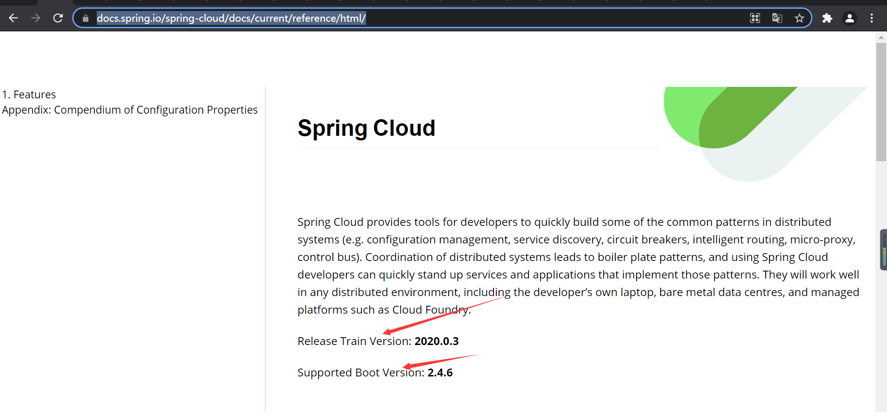
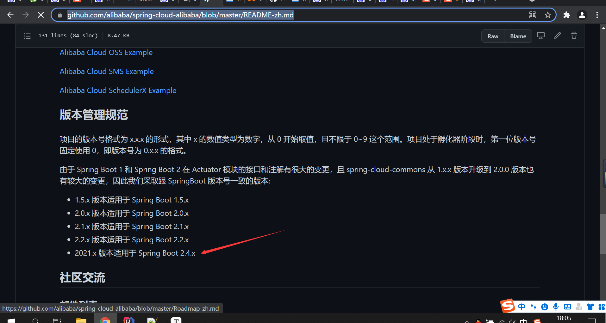

# 版本依赖控制

> springcloud,springboot,springcloud alibaba版本选择

## 思路

通过springcloud的版本，选择springboot的版本，通过springboot 的版本去选择springcloud alibaba的依赖

### springcloud版本选择

> 也就是spring-cloud-dependencies-parent版本控制器，以前是spring-cloud-dependencies

选择地址：https://spring.io/projects/spring-cloud#learn

选择GA版本

点进去可以查看这个版本依赖的springboot版本： https://docs.spring.io/spring-cloud/docs/current/reference/html/

如图：



### springcloud alibaba版本选择

> 也就是选择阿里巴巴提供的springcloud方案spring-cloud-alibaba-dependencies

参考地址：https://github.com/alibaba/spring-cloud-alibaba/blob/master/README-zh.md



### 最新依赖管理

```xml
	<dependencyManagement>
		<dependencies>
			<dependency>
				<groupId>group.springframework</groupId>
				<artifactId>spring-cloud-dependencies-parent</artifactId>
				<version>2020.0.3</version>
				<type>pom</type>
				<scope>import</scope>
			</dependency>
			<dependency>
				<groupId>com.alibaba.cloud</groupId>
				<artifactId>spring-cloud-alibaba-dependencies</artifactId>
				<version>2021.1</version>
				<type>pom</type>
				<scope>import</scope>
			</dependency>
		</dependencies>
	</dependencyManagement>
```

## 附录

### 阿里maven仓库地址：

https://developer.aliyun.com/mvn/search

可以查看现在都有哪些依赖的版本。

### 引不进依赖管理的问题

直接在dependencyManagement引入依赖管理，不知为什么提示找不到

<p style='color:red'>解决方法：</p>

同时在dependencies中引入依赖 或者 先在dependencies引入，然后删除dependencies的依赖。

猜测可能是idea的问题，或者就是自己maven的问题，因为我在springcloud alibaba上面看他们就是这样进行依赖控制的。https://spring-cloud-alibaba-group.github.io/github-pages/hoxton/en-us/index.html#_service_registrationdiscovery_nacos_discovery

