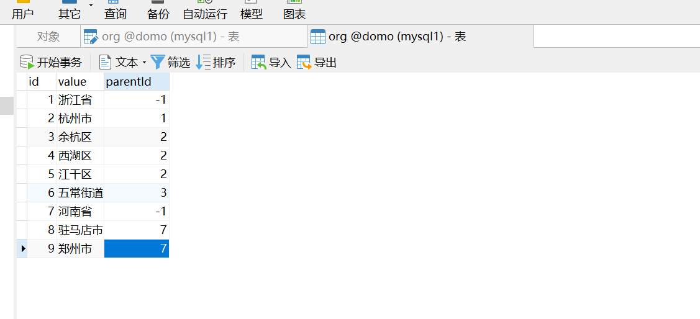
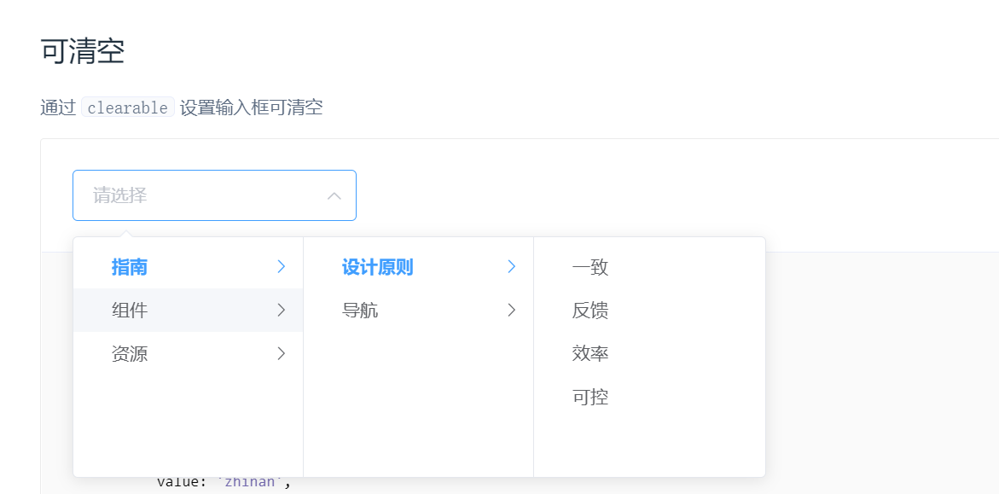

# 递归算法

## 使用场景

### 获取组织树

> 结合element-ui中Cascader 级联选择器使用

#### 表结构



#### sql语句

```java
@Repository
public interface OrgTreeMapper {
    @Select("select * from org where parentId = #{parentId}")
    List<OrgTree> getChildList(int parentId);

}
```

#### 逻辑代码

```
@Test
    void contextLoads() {
        List tree = getTree(-1);
        System.out.println(tree.toString());

    }

    public List getTree(int parentId){
        List<OrgTree> childList = orgTreeMapper.getChildList(parentId);
        List list = new ArrayList();
        for (OrgTree orgTree:childList){
            Map map = new HashMap();
            map.put("label",orgTree.getValue());
            map.put("value",orgTree.getId());
            int id = orgTree.getId();
            List children = getTree(id);
            if (children != null && children.size() > 0){
                map.put("children",children);
            }
            list.add(map);
        }
        return list;
    }
```

#### 效果

